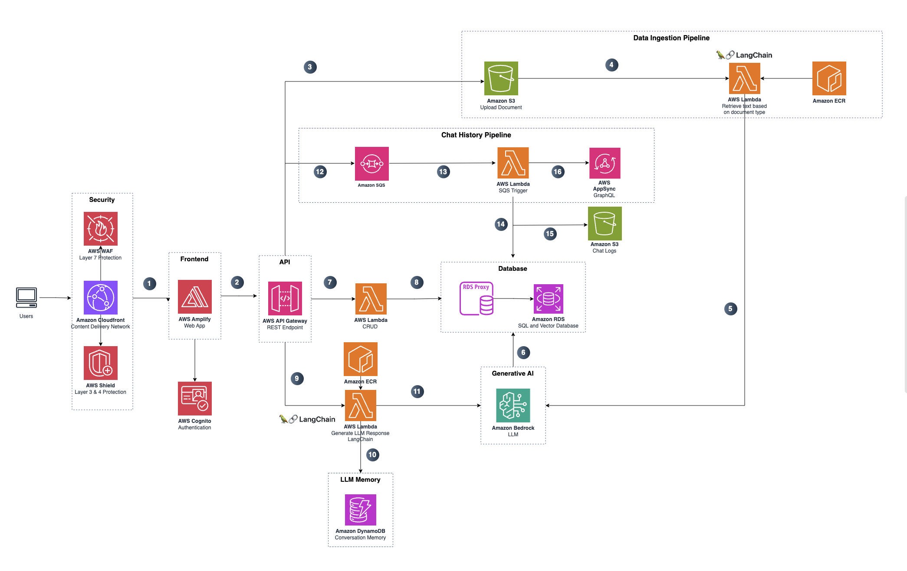

# Architecture Deep Dive

## Architecture



## Description

1. The user sends a request to the application hosted on AWS Amplify.
2. Amplify integrates with the backend API Gateway.
3. Instructors can upload course materials to the application, which are stored in an S3 bucket using a pre-signed upload URL.
4. Adding a new course file to the S3 bucket triggers the data ingestion workflow, with a lambda function extracting the text from the file.
5. The lambda function embeds the text into vectors using Amazon Bedrock. This project uses the Amazon Titan Text Embeddings V2 model to generate embeddings.
6. The lambda function stores the vectors in the PostgreSQL database.
7. Users can perform course management/access actions by sending an API request which invokes a lambda function.
8. This lambda function interacts with Amazon RDS.
9. Users can start chatting with the LLM by sending an API request that invokes the lambda function to generate a response.
10. The lambda function stores the embedded messages in Amazon DynamoDB
11. This lambda function uses RAG architecture to retrieve the response from LLMs hosted on Amazon Bedrock augmented with the course's information stored in the Amazon RDS.

## Database Schema


### RDS Langchain Tables

### `langchain_pg_collection` table

| Column Name | Description                    |
| ----------- | ------------------------------ |
| `uuid`      | The uuid of the collection     |
| `name`      | The name of the collection     |
| `cmetadata` | The metadata of the collection |

### `langchain_pg_embedding` table

| Column Name     | Description                           |
| --------------- | ------------------------------------- |
| `id`            | The ID of the embeddings              |
| `collection_id` | The uuid of the collection            |
| `embedding`     | The vector embeddings of the document |
| `cmetadata`     | The metadata of the collection        |
| `document`      | The content of the document           |

### RDS PostgreSQL Tables

### `Users` table

| Column Name            | Description                             |
| ---------------------- | --------------------------------------- |
| `user_id`              | The ID of the user                      |
| `user_email`           | The email of the user                   |
| `username`             | The username of the user                |
| `first_name`           | The first name of the user              |
| `last_name`            | The last name of the user               |
| `preferred_name`       | The preferred name of the user          |
| `time_account_created` | The time the account was created in UTC |
| `roles`                | The roles of the user                   |
| `last_sign_in`         | The time the user last signed in in UTC |

### `Courses` table

| Column Name             | Description                                     |
| ----------------------- | ----------------------------------------------- |
| `course_id`             | The ID of the course                            |
| `course_name`           | The name of the course                          |
| `course_department`     | The acronym of the course department            |
| `course_number`         | The number of the course                        |
| `course_access_code`    | The access code for students to join the course |
| `course_student_access` | Whether or not student can access the course    |
| `system_prompt`         | The system prompt for the course                |

### `Enrolments` table

| Column Name                    | Description                                               |
| ------------------------------ | --------------------------------------------------------- |
| `enrolment_id`                 | The ID of the enrolment                                   |
| `user_id`                      | The ID of the enrolled user                               |
| `course_id`                    | The ID of the associated course                           |
| `enrolment_type`               | The type of enrolment (e.g., student, instructor, admin)  |
| `course_completion_percentage` | The percentage of the course completed (currently unused) |
| `time_spent`                   | The time spent in the course (currently unused)           |
| `time_enroled`                 | The timestamp when the enrolment occurred                 |

### `Course_Concepts` table

| Column Name      | Description                     |
| ---------------- | ------------------------------- |
| `concept_id`     | The ID of the concept           |
| `course_id`      | The ID of the associated course |
| `concept_name`   | The name of the concept         |
| `concept_number` | The number of the concept       |

### `Course_Modules` table

| Column Name     | Description                      |
| --------------- | -------------------------------- |
| `module_id`     | The ID of the module             |
| `concept_id`    | The ID of the associated concept |
| `module_name`   | The name of the module           |
| `module_number` | The number of the module         |

### `Module_Files` table

| Column Name           | Description                                  |
| --------------------- | -------------------------------------------- |
| `file_id`             | The ID of the file                           |
| `module_id`           | The ID of the associated module              |
| `filetype`            | The type of the file (e.g., pdf, docx, etc.) |
| `s3_bucket_reference` | The reference to the S3 bucket               |
| `filepath`            | The path to the file in the S3 bucket        |
| `filename`            | The name of the file                         |
| `time_uploaded`       | The timestamp when the file was uploaded     |
| `metadata`            | Additional metadata about the file           |

### `Student_Modules` table

| Column Name                | Description                                             |
| -------------------------- | ------------------------------------------------------- |
| `student_module_id`        | The ID of the student module                            |
| `course_module_id`         | The ID of the associated course module                  |
| `enrolment_id`             | The ID of the related enrolment                         |
| `module_score`             | The score achieved by the student in the module         |
| `last_accessed`            | The timestamp of the last time the module was accessed  |
| `module_context_embedding` | A float array representing the module context embedding |

### `Sessions` table

| Column Name                  | Description                                                                  |
| ---------------------------- | ---------------------------------------------------------------------------- |
| `session_id`                 | The ID of the session                                                        |
| `student_module_id`          | The ID of the associated student module                                      |
| `session_name`               | The name of the session                                                      |
| `session_context_embeddings` | A float array representing the session context embeddings (currently unused) |
| `last_accessed`              | The timestamp of the last time the session was accessed                      |

### `Messages` table

| Column Name       | Description                                           |
| ----------------- | ----------------------------------------------------- |
| `message_id`      | The ID of the message                                 |
| `session_id`      | The ID of the associated session                      |
| `student_sent`    | Whether the message was sent by the student (boolean) |
| `message_content` | The content of the message (currently unused)         |
| `time_sent`       | The timestamp when the message was sent               |

### `User_Engagement_Log` table

| Column Name       | Description                                  |
| ----------------- | -------------------------------------------- |
| `log_id`          | The ID of the engagement log entry           |
| `user_id`         | The ID of the user                           |
| `course_id`       | The ID of the associated course              |
| `module_id`       | The ID of the associated module              |
| `enrolment_id`    | The ID of the related enrolment              |
| `timestamp`       | The timestamp of the engagement event        |
| `engagement_type` | The type of engagement (e.g., module access) |

## S3 Structure

```
.
├── {course_id_1}
│   └── {module_name}_{module_id}
│       └── documents
│           ├── document1.pdf
│           └── document2.pdf
└── {course_id_2}
    └── {module_name}_{module_id}
        └── documents
            ├── document1.pdf
            └── document2.pdf

```
