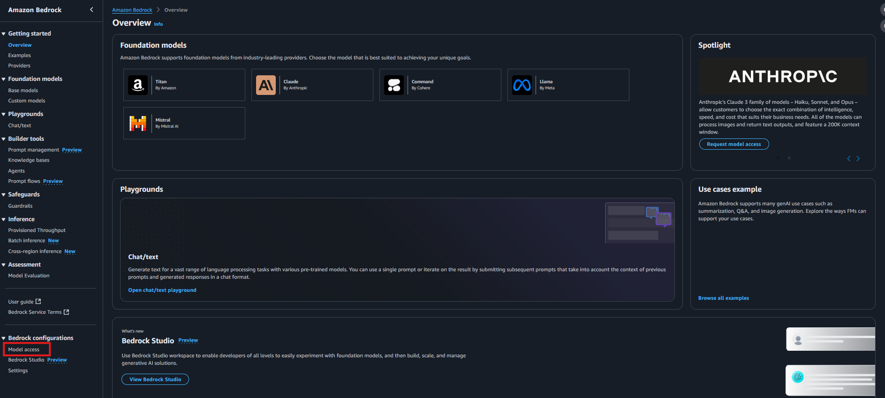
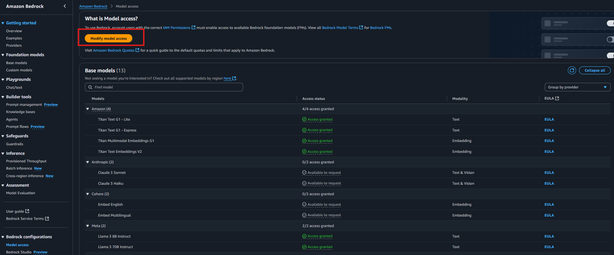
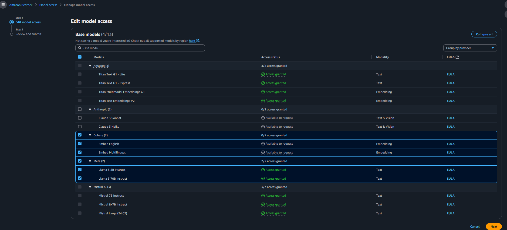

# Deployment Guide

## Table of Contents
- [Deployment Guide](#deployment-guide)
  - [Table of Contents](#table-of-contents)
  - [Requirements](#requirements)
  - [Pre-Deployment](#pre-deployment)
    - [Create GitHub Personal Access Token](#create-github-personal-access-token)
    - [Enable Models in Bedrock](#enable-models-in-bedrock)
  - [Deployment](#deployment)
    - [Step 1: Fork \& Clone The Repository](#step-1-fork--clone-the-repository)
    - [Step 2: Upload Secrets](#step-2-upload-secrets)
      - [CDK Deployment in Hybrid Cloud Environment](#cdk-deployment-in-hybrid-cloud-environment)
      - [Step-by-Step Instructions](#step-by-step-instructions)
    - [Step 3: CDK Deployment](#step-3-cdk-deployment)
  - [Post-Deployment](#post-deployment)
    - [Step 1: Build AWS Amplify App](#step-1-build-aws-amplify-app)
    - [Step 2: Change Redirects](#step-2-change-redirects)
    - [Step 3: Visit Web App](#step-3-visit-web-app)
  - [Cleanup](#cleanup)
    - [Taking down the deployed stack](#taking-down-the-deployed-stack)

## Requirements
Before you deploy, you must have the following installed on your device:
- [git](https://git-scm.com/downloads)
- [AWS Account](https://aws.amazon.com/account/)
- [GitHub Account](https://github.com/)
- [AWS CLI](https://aws.amazon.com/cli/)
- [AWS CDK](https://docs.aws.amazon.com/cdk/v2/guide/cli.html) *(v2.122.0 > required)*
- [npm](https://docs.npmjs.com/downloading-and-installing-node-js-and-npm)
- [node](https://nodejs.org/en/ln/getting-started/how-to-install-nodejs) *(v20.0.0 > required)*
- [docker](https://www.docker.com/products/docker-desktop/)

## Pre-Deployment
### Create GitHub Personal Access Token
To deploy this solution, you will need to generate a GitHub personal access token. Please visit [here](https://docs.github.com/en/authentication/keeping-your-account-and-data-secure/managing-your-personal-access-tokens#creating-a-personal-access-token-classic) for detailed instruction to create a personal access token.

*Note: when selecting the scopes to grant the token (step 8 of the instruction), make sure you select `repo` scope.*

**Once you create a token, please note down its value as you will use it later in the deployment process.**

Docker must also be running for the deployment to work.

### Enable Models in Bedrock

First, navigate to Amazon Bedrock in the AWS Console. From the home page, click on model access under Bedrock configurations:


Then click on "Modify model access":


Finally, enable the relevant models, click next and on the next page click submit. Amazon Titan Embeddings V2 and Meta Llama 3 70B Instruct are required for this project.


The relevant models are now enabled in Bedrock.
## Deployment
### Step 1: Fork & Clone The Repository
First, you need to fork the repository. To create a fork, navigate to the [main branch](https://github.com/UBC-CIC/AI-Learning-Assistant) of this repository. Then, in the top-right corner, click `Fork`.


You will be directed to the page where you can customize owner, repository name, etc, but you do not have to change any option. Simply click `Create fork` in the bottom right corner.

Now let's clone the GitHub repository onto your machine. To do this:
1. Create a folder on your computer to contain the project code.
2. For an Apple computer, open Terminal. If on a Windows machine, open Command Prompt or Windows Terminal. Enter into the folder you made using the command `cd path/to/folder`. To find the path to a folder on a Mac, right click on the folder and press `Get Info`, then select the whole text found under `Where:` and copy with ⌘C. On Windows (not WSL), enter into the folder on File Explorer and click on the path box (located to the left of the search bar), then copy the whole text that shows up.
3. Clone the GitHub repository by entering the following command. Be sure to replace `<YOUR-GITHUB-USERNAME>` with your own username.
```
git clone https://github.com/<YOUR-GITHUB-USERNAME>/AI-Learning-Assistant.git
```
The code should now be in the folder you created. Navigate into the root folder containing the entire codebase by running the command:
```
cd AI-Learning-Assistant
```

### Step 2: Upload Secrets
You would have to supply your GitHub personal access token you created earlier when deploying the solution. Run the following command and ensure you replace `<YOUR-GITHUB-TOKEN>` and `<YOUR-PROFILE-NAME>` with your actual GitHub token and the appropriate AWS profile name.
```
aws secretsmanager create-secret \
    --name github-personal-access-token \
    --secret-string '{\"my-github-token\":\"<YOUR-GITHUB-TOKEN>\"}'\
    --profile <YOUR-PROFILE-NAME>
```

Moreover, you will need to upload your github username to Amazon SSM Parameter Store. You can do so by running the following command. Make sure you replace `<YOUR-GITHUB-USERNAME>` and `<YOUR-PROFILE-NAME>` with your actual username and the appropriate AWS profile name.

```
aws ssm put-parameter \
    --name "aila-owner-name" \
    --value "<YOUR-GITHUB-USERNAME>" \
    --type String \
    --profile <YOUR-PROFILE-NAME>
```

You would have to supply a custom database username when deploying the solution to increase security. Run the following command and ensure you replace `<YOUR-DB-USERNAME>` with the custom name of your choice.

```
aws secretsmanager create-secret \
    --name AILASecrets \
    --secret-string '{\"DB_Username\":\"<YOUR-DB-USERNAME>\"}'\
    --profile <your-profile-name>
```

For example,

```
aws secretsmanager create-secret \
    --name AILASecrets \
    --secret-string '{\"DB_Username\":\"AILASecrets\"}'\
    --profile <your-profile-name>
```

Finally, in order to restrict user sign up to specific email domains, you will need to upload a comma separated list of allowed email domains to Amazon SSM Parameter Store. You can do so by running the following command. Make sure you replace `<YOUR-ALLOWED-EMAIL-DOMAIN-LIST>` and `<YOUR-PROFILE-NAME>` with your actual list and the appropriate AWS profile name.

```
aws ssm put-parameter \
    --name "/AILA/AllowedEmailDomains" \
    --value "<YOUR-ALLOWED-EMAIL-DOMAIN-LIST>" \
    --type SecureString \
    --profile <YOUR-PROFILE-NAME>
```

For example,

```
aws ssm put-parameter \
    --name "/AILA/AllowedEmailDomains" \
    --value "gmail.com,ubc.ca" \
    --type SecureString \
    --profile <YOUR-PROFILE-NAME>
```

#### CDK Deployment in Hybrid Cloud Environment

The following set of instructions are only if you want to deploy this application in a **hybrid cloud environment**. If you do not want to do this you can skip this section.

In order to deploy in a hybrid cloud environment, you will need to have access to the **aws-controltower-VPC** and the name of your **AWSControlTowerStackSet**.

#### Step-by-Step Instructions

1. **Modify the VPC Stack:**
   - Navigate to the `vpc-stack.ts` file located at `cdk/lib/vpc-stack.ts`.
   - Replace **line 13** with your existing VPC ID:
     ```typescript
     const existingVpcId: string = 'your-vpc-id'; //CHANGE IF DEPLOYING WITH EXISTING VPC
     ```
     You can find your VPC ID by navigating to the **VPC dashboard** in the AWS Management Console and locating the VPC in the `Your VPCs` section.

     

2. **Update the AWS Control Tower Stack Set:**
   - Replace **line 21** with your AWS Control Tower Stack Set name:
     ```typescript
     const AWSControlTowerStackSet = "your-stackset-name"; //CHANGE TO YOUR CONTROL TOWER STACK SET
     ```
     You can find this name by navigating to the **CloudFormation dashboard** in AWS, under `Stacks`. Look for a stack name that starts with `StackSet-AWSControlTowerBP-VPC-ACCOUNT-FACTORY`.

     


You can proceed with the rest of the deployment instructions and the Vpc Stack will automatically use your existing VPC instead of creating a new one. For more detailed information about the hybrid cloud deployment you checkout the [Hybrid Cloud Deployment Guide](/docs/HybridCloudDeploymentGuide.md)


### Step 3: CDK Deployment
It's time to set up everything that goes on behind the scenes! For more information on how the backend works, feel free to refer to the Architecture Deep Dive, but an understanding of the backend is not necessary for deployment.

Open a terminal in the `/cdk` directory.

**Download Requirements**: Install requirements with npm by running `npm install` command.


**Initialize the CDK stack**(required only if you have not deployed any resources with CDK in this region before). Please replace `<your-profile-name>` with the appropriate AWS profile used earlier.
```
cdk synth --profile <your-profile-name>
cdk bootstrap aws://<YOUR_AWS_ACCOUNT_ID>/<YOUR_ACCOUNT_REGION> --profile <your-profile-name>
```

**Deploy CDK stack**
 You may run the following command to deploy the stacks all at once. Again, replace `<your-profile-name>` with the appropriate AWS profile used earlier. Also replace `<your-stack-prefix>` with the appropriate stack prefix.
The stack prefix will be prefixed onto the physical names of the resources created during deployment.
```
cdk deploy --all \
 --parameters <your-stack-prefix>-AmplifyStack:githubRepoName=AI-Learning-Assistant \
 --context StackPrefix=<your-stack-prefix> \
 --profile <your-profile-name>
```

For example:
```
cdk deploy --all --parameters AILA-AmplifyStack:githubRepoName=AI-Learning-Assistant --context StackPrefix=AILA --profile <your-profile-name>
```

If you have trouble running the commands, try removing all the \ and run it in one line.

## Post-Deployment
### Step 1: Build AWS Amplify App

1. Log in to AWS console, and navigate to **AWS Amplify**. You can do so by typing `Amplify` in the search bar at the top.
2. From `All apps`, click `aila-amplify`.
3. Then click `main` under `branches`
4. Click `run job` and wait for the build to complete.
5. You now have access to the `Amplify App ID` and the public domain name to use the web app.

### Step 2: Change Redirects

1. Click back to navigate to `aila-amplify/Overview`
2. In the left side bar click   `Rewrites and Redirects` under `Hosting`
3. Click `manage redirects` on the top right
4. Click `add rewrite`
5. For `Source address` type `</^[^.]+$|.(?!(css|gif|ico|jpg|js|png|txt|svg|woff|woff2|ttf|map|json|webp)$)([^.]+$)/>`
6. For `Target address` type `/`
7. For `Type` select `404 (Redirect)`
8. Click `Save`

### Step 3: Visit Web App
You can now navigate to the web app URL to see your application in action.

## Cleanup
### Taking down the deployed stack
To take down the deployed stack for a fresh redeployment in the future, navigate to AWS Cloudformation on the AWS Console, click on the stack and hit Delete.

Please wait for the stacks in each step to be properly deleted before deleting the stack downstream.

Also make sure to delete secrets in Secrets Manager.
