# User Guide

**Please ensure the application is deployed, instructions in the deployment guide here:**
- [Deployment Guide](./deploymentGuide.md)

Once you have deployed the solution, the following user guide will help you navigate the functions available.

| Index    | Description |
| -------- | ------- |
| [Administrator View](#admin-view)  | How the Admnistrator views the project | 
| [Instructor View](#instructor-view)  | How the Instructor views the project |
| [Student View](#student-view)  | How the Student views the project |

## Administrator View
To sign up as an administrator, you need to sign up regularly first as a student:
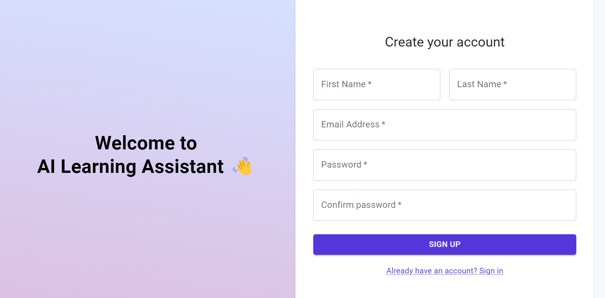

You then get a confirmation email to verify your email. Once you have a student account, to become an adminstrator, you need to change your user group with Cognito through the AWS Console:

After clicking the user pool of the project, you need to find your email:
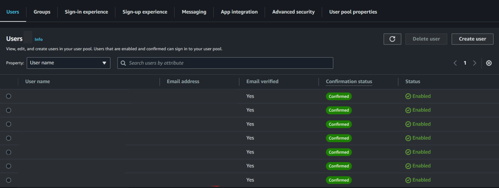

After clicking your email, you can add the 'admin' user group:

Once the 'admin' user group is added, delete the 'student' user group:

Upon logging in as an administrator, they see the following home page:
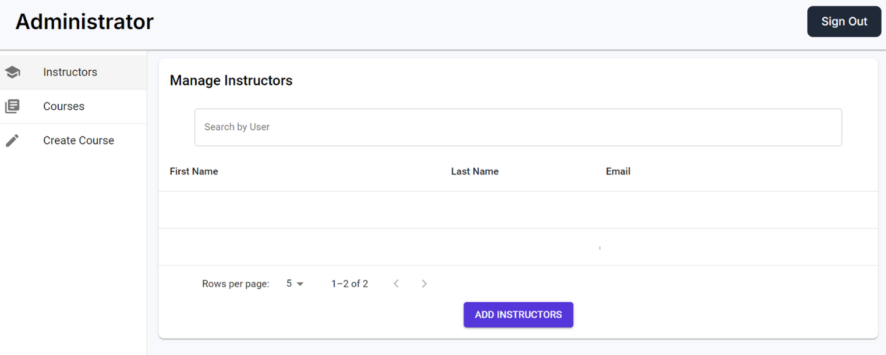

Clicking the "ADD INSTRUCTOR" button opens a pop-up where the administrator can enter the email address of a user with an account to add them as an administrator:
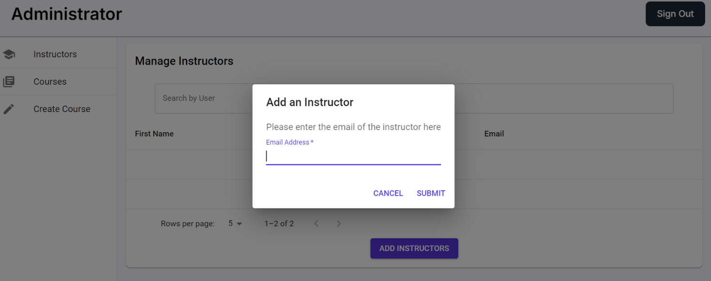

The administrator can also click an instructor in the list which takes them to a page consisting of that instructor's details which includes their name, email, and active courses:
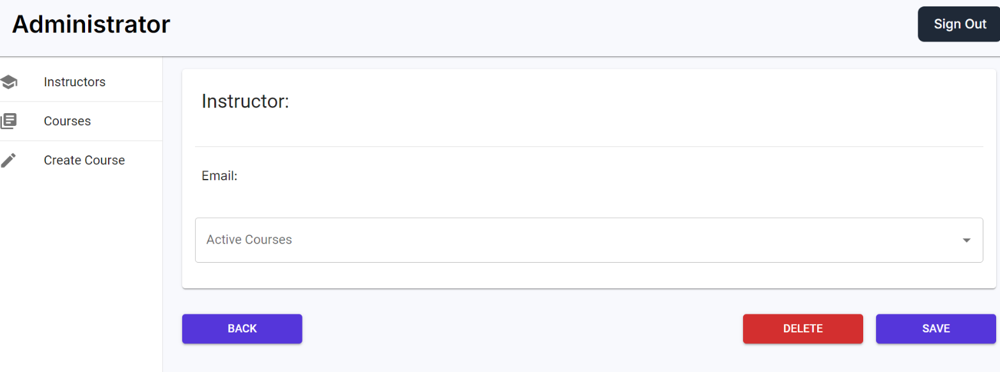

In the "Courses" tab, the administrator can view a list of the courses available in this project:
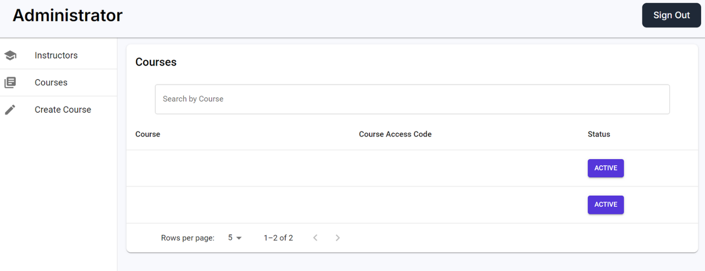

Clicking the "Active" button leads to a page where the administrator can view all the instructors in that course while being able to change the status of the course:
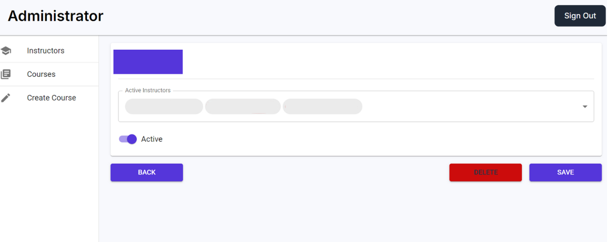

In the "Create Course" tab, the administrator can create a course by specifying the name, department, and code of the course. The administrator can also assign instructors to the course here while changing the "System Prompt" that the Large Language Model (LLM) uses as intructions when generating responses:
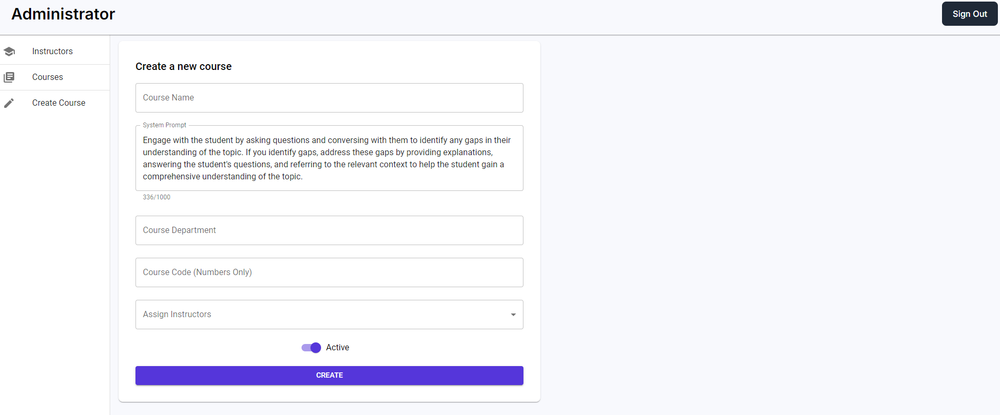

## Instructor View
Upon logging in as an instructor, they see the following home page:

The instructor can click on the "Student View" to see the project how a student would. For more information on how a student views the project, click [here](#student-view). After clicking the "ACTIVE" button beside a course, the instructor can see the analytics of that course with several insights:
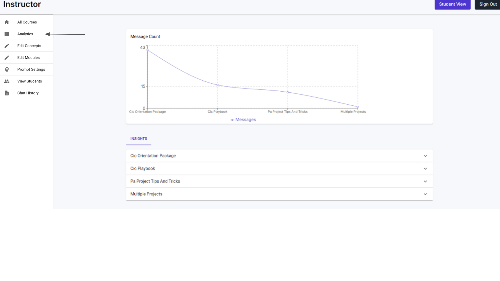

Clicking the "Edit Concepts" tab leads to a page where the instructor can see a list of concepts within the course. Here a new concept can be created or existing concepts can be edited or deleted:
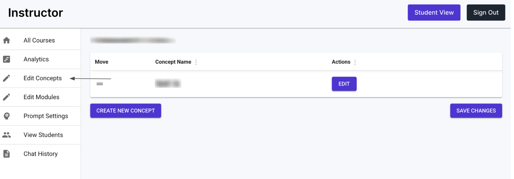

Clicking the "Edit Modules" tab leads to a page where the instructor can see a list of modules along with the concepts they belong to in that course. Here a new module can be created or existing modules can be edited:
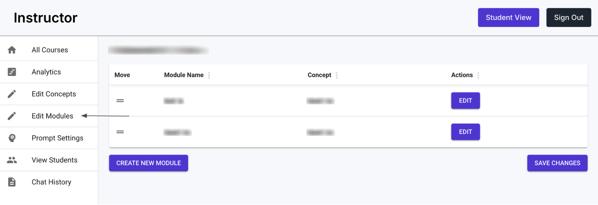

Clicking the "CREATE NEW MODULE" button leads to a page where the instructor can create a module. The module's name can be specified here along with the concept it belongs to. The instructor can then upload files to this module from their device. `PDF`, `DOCX`, `PPTX`, `TXT`, `XLSX`, `XPS`, `MOBI`, and `CBZ` file types are supported. The "SAVE MODULE" button here saves the module:

Clicking the "EDIT" button beside a course leads to a page similar to creating a module. The module's name and concept can be changed here. The instructor can also remove previous files from the module while adding new ones. Each file in the module can be downloaded on the instructor's device. The "SAVE MODULE" button here saves the changes made to the module and the "DELETE MODULE" deletes the entire module:
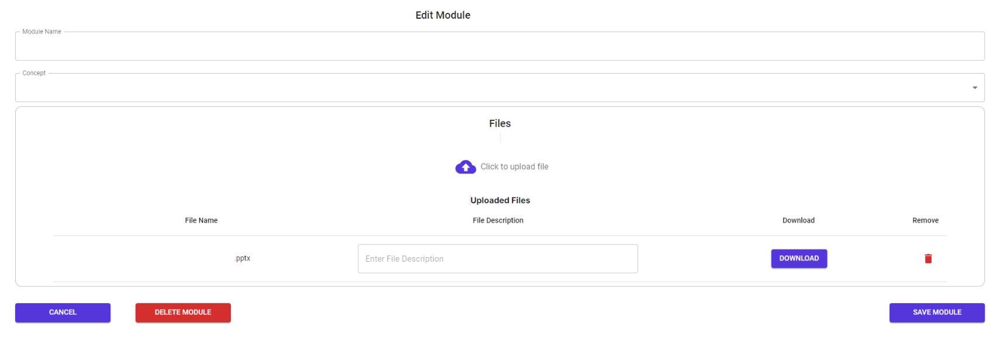

Clicking the "Prompt Settings" tab leads to a page where the instructor can change the prompt applied to the LLM for this specific course. Upon applying a new prompt, the instructor can also scroll to previous prompts the course used:
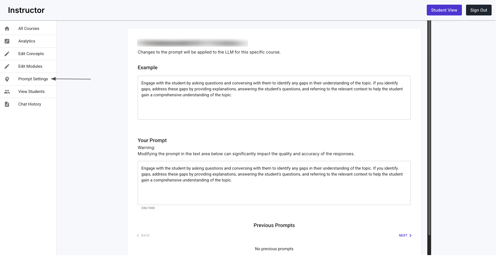

Clicking the "View Students" tab leads to a page where the instructor can view all the students in this course. The "Access Code" of the course is a special code that allows students to join the course. The instructor will have to send this code to them. The instructor can also generate a new course code on this page:
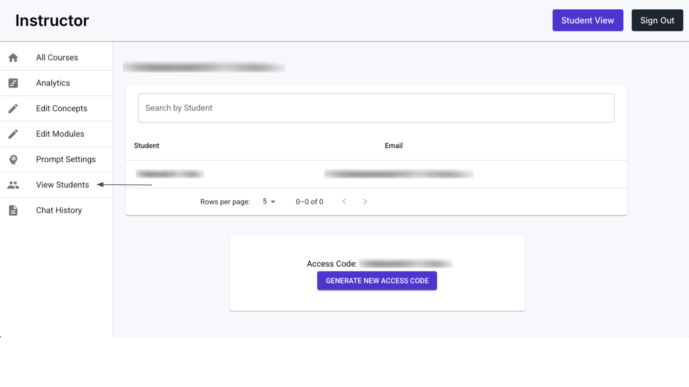

The instructor can then click on a student which takes them to that student's chat logs for every module in the course. Each tab represents a different module. Different conversations with the LLM are rendered as different drop downs:

Clicking the "Chat History" tab directs the instructor to a dedicated page where they can request a document containing the chat logs for all course sessions. Once the chat log file has been successfully generated, it will be displayed on this page, complete with the generation timestamp and a download option, allowing the instructor to easily access and save the chat logs locally if desired. If the user navigates to another screen while the request is processing, they will receive a notification once the file is ready, indicating that the chat logs are available for download:
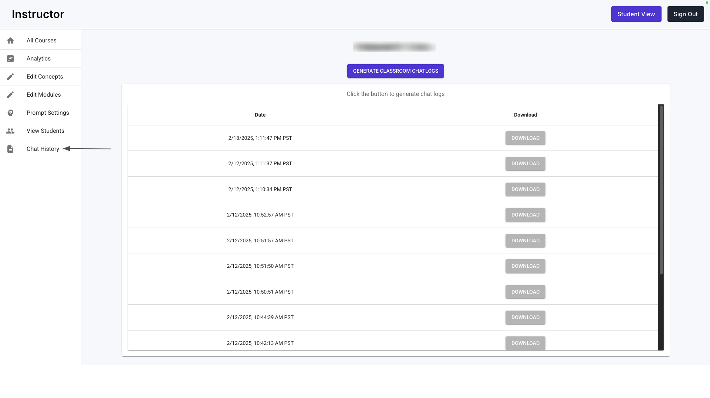

## Student View
Upon logging in as an student, they see the following home page:

We are going to be looking at the CPSC 210 course as an example. Upon selecting CPSC 210, the student is shown a list of concepts at the top: Basics, Abstraction, Construction, and Design. Within each concept, there are several modules. For example, the Basics concept has the Program Structure, Methods And Calls, Classes, and Data Flow modules:
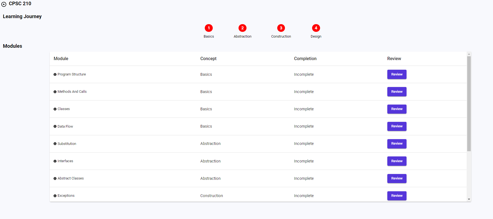

If we click the "Review" button beside the Program Structure module, we are taken to a page where an LLM asks us a question and creates a new conversation:
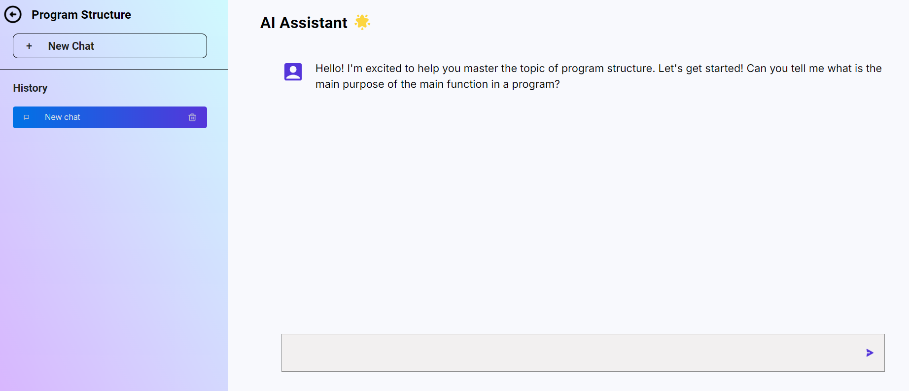

The student can then answer the questions the LLM asks in a conversation manner. Upon answering multiple questions correctly, the LLM determines when the student has achieved competency over the module:
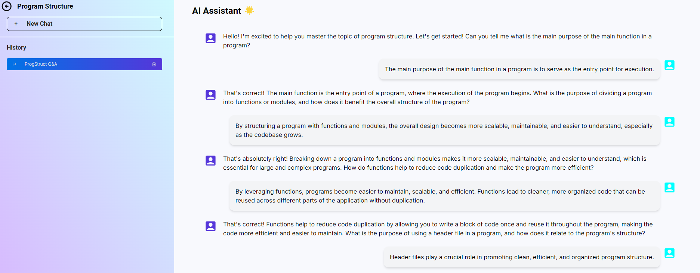
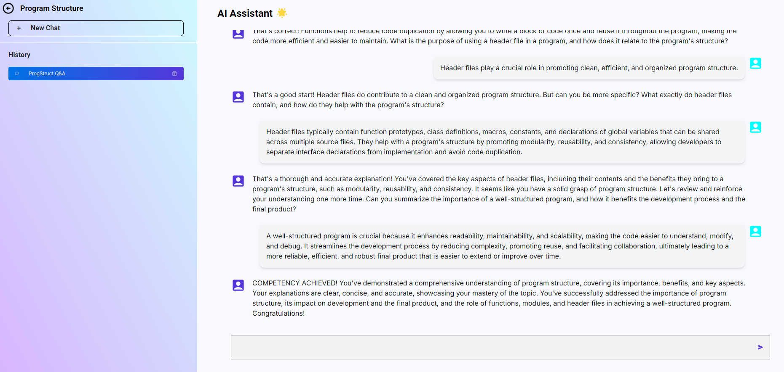

Upon going back to the list of modules in this course, the student can see their learning journey as the module they achieved competency for is complete. The concept that module belonged to has also slightly changed in color by going from an inital red color to orange:
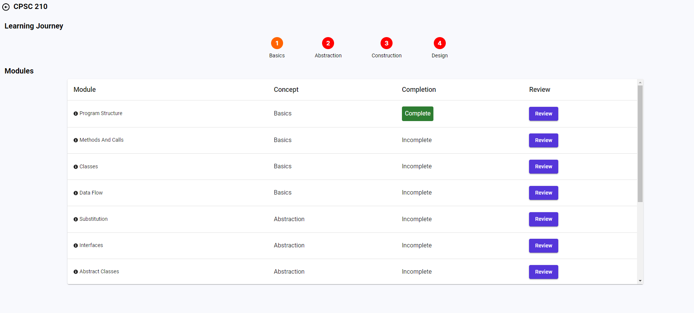

After completing more modules, the concept those modules belongs to gradually changes color to show the student's learning journey:
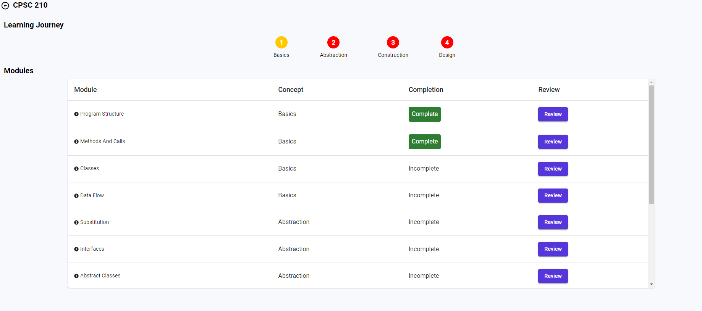
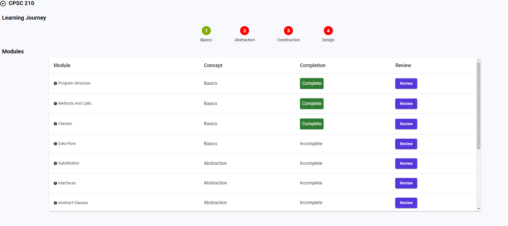

